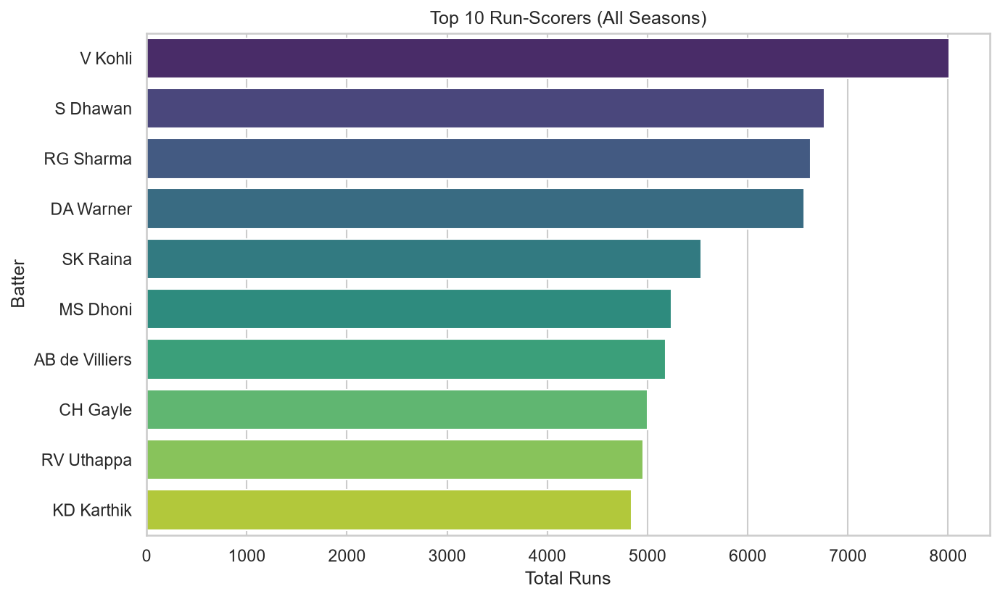
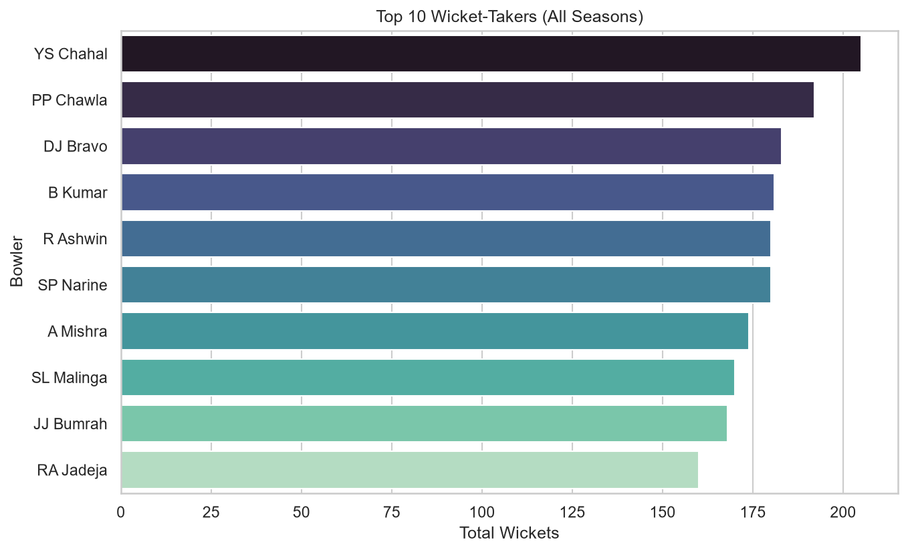
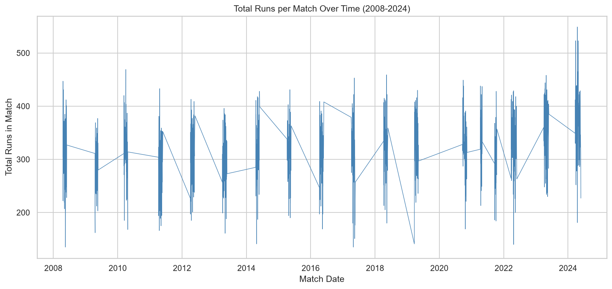
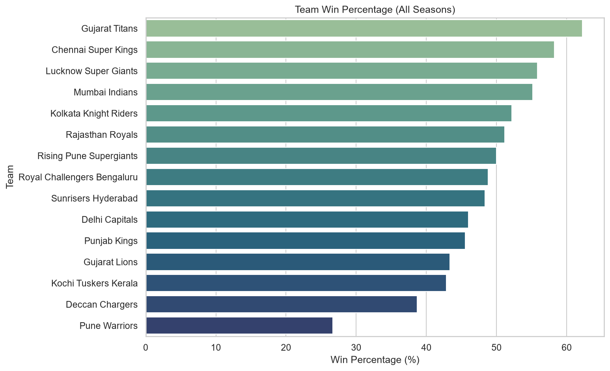

# IPL Cricket Stats Dashboard - AVIP 2026 (B.Y.T.E by Arithmatrix)

## Dataset
Source: https://www.kaggle.com/datasets/patrickb1912/ipl-complete-dataset-20082020
Extraction date: September 2026
Covers 2008-2024 seasons: matches.csv (match-level results) and deliveries.csv (ball-by-ball data)

## Cleaning Steps
- Removed 5 matches with no winner (rain-affected / no result)
- Standardized inconsistent team names across seasons (e.g. Rising Pune Supergiant/Supergiants, Royal Challengers Bangalore/Bengaluru, Delhi Daredevils/Capitals, Kings XI Punjab/Punjab Kings)
- Excluded run-outs and other non-bowler dismissals when calculating wicket-taker stats, per cricket scoring rules
- Created a season_sort column to order seasons chronologically

## Files
- ipl_dashboard.ipynb - full analysis notebook with interactive season filter
- data/matches.csv, data/deliveries.csv - source data
- images/ - exported charts

## Charts

## Key Findings
- V Kohli leads all-time run-scoring with 8,014 runs
- YS Chahal is the all-time leading wicket-taker with 205 wickets
- Gujarat Titans have the highest win percentage at 62.2%
- Average runs per match: 318.4 (range: 135 to 549)

## Interactive Filter
The notebook includes a season dropdown filter (ipywidgets) that lets you view top run-scorers and team wins for any individual season from 2008 to 2024.

## Conclusion
This analysis of 17 seasons of IPL data shows that individual excellence and strong franchise management both play major roles in IPL success. Match-level scoring has stayed relatively consistent across seasons. A natural next step would be studying how toss decisions or powerplay performance specifically influence match outcomes.
